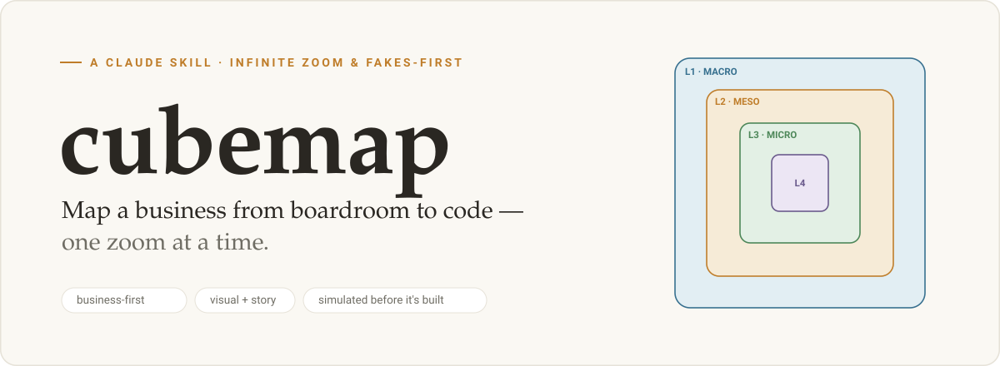
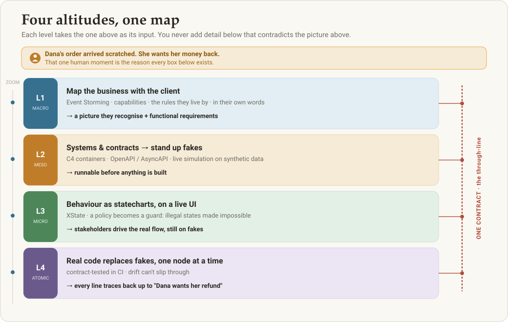
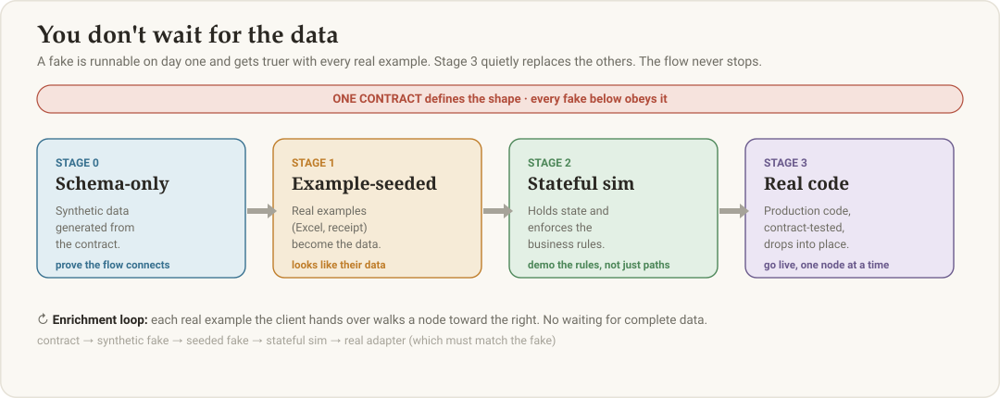
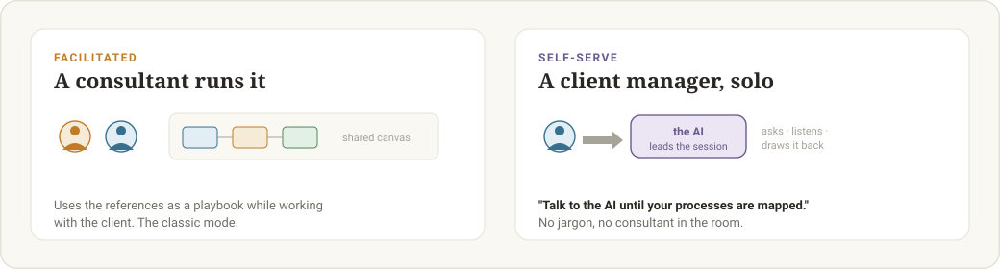

<p align="center">
  
</p>

<p align="center">
  <a href="LICENSE"></a>
  
  
  <a href="https://github.com/p-vbordei/dsl"></a>
</p>

<p align="center"><i>A Claude skill for going to a client, mapping how their business actually works,<br>and turning it into functional requirements for an AI-driven organisation — then a simulation, then real code.</i></p>

---

## Why this exists

A team rarely fails because the code was bad. It fails because **nobody ever drew the business clearly enough** for everyone — the client included — to point at it and say *"yes, that's how it works."*

So `cubemap` starts there. You sit with the people who run the business and draw it, out loud, together. Then you zoom in — like Google Maps for a software system. Stand at country level and see whole business capabilities; zoom to the street level of a single function. **At every altitude the picture still makes sense and still connects to the one above it.**

> Take a real moment: *an employee receives a file that looks like a receipt, keys it into the old system, prints a report, and emails it to finance for sign-off — and anything over €10,000 goes to a manager instead.* That sentence is a whole system in disguise. `cubemap` is the discipline for pulling it apart, simulating it, and building it — without ever losing the thread back to why it matters.

## The idea in one minute

- **Map the business with the people who run it.** Event Storming on a shared canvas: capabilities, the events between them, and the rules they live by — in the client's own words.
- **Virtualize early — you don't need all the data first.** The moment a contract exists, stand up a *fake* that obeys it and serves synthetic data. The whole flow is clickable before anything is built.
- **Enrich progressively.** As real examples arrive (an Excel export, a receipt, a report), feed them in; the simulation and the written-up process converge on reality, iteration by iteration.
- **Make illegal states impossible.** Business rules become statechart guards and contract constraints — something the system *cannot* violate, not something a developer must remember.
- **One source of truth for meaning and structure.** A shared lexicon of the client's vocabulary + a single contract per boundary keep business and code reading the same model.

## Four altitudes, one map

Work top-down. Each level takes the one above as its input; you never introduce detail below that contradicts the picture above.

<p align="center">
  
</p>

| Level | Whose view | Produces |
|-------|-----------|----------|
| **L1 · Macro** | CEO / domain expert | Business capabilities, events, policies — the "why" |
| **L2 · Meso** | Architect | Systems (C4), contracts, **live fakes** on synthetic data |
| **L3 · Micro** | Engineer / UX | Behaviour as statecharts, wired to the fakes |
| **L4 · Atomic** | Engineer | Real code that honours the contracts & statecharts above |

## You don't wait for the data

This is the part most teams get wrong. A contract defines the *shape* of the data — and that shape alone is enough to generate plausible synthetic data and serve it from a fake. The flow is runnable on **day one**, and gets truer with every real example the client hands over.

<p align="center">
  
</p>

## Two ways to use it

<p align="center">
  
</p>

- **Facilitated** — a consultant or architect runs it as a playbook with the client.
- **Self-serve by a client manager** — hand the skill to a non-technical department manager and say *"talk to the AI until your processes are mapped."* The AI becomes the facilitator: it leads, they answer, and it keeps going until the map, the requirements, and the lexicon are complete. See [`references/guided-client-intake.md`](references/guided-client-intake.md).

## Speak the client's language

`cubemap` builds the client's vocabulary as it maps. Its companion, the [**`dsl` skill — Domain-Shared Lexicon**](https://github.com/p-vbordei/dsl), stores and reloads that vocabulary as a `LEXICON.md` so the AI always uses the client's exact terms — never quietly swapping *Heat* for *batch* and carrying the wrong meaning downstream. Use the two together.

## Visual by default

Explanations are **purpose-built SVG**, never Mermaid or walls of text, designed to match how people actually read — one idea, one picture, a story spine. The preferred deliverable is a **scrollytelling editorial explainer** (warm paper palette, semantic colours, dark mode, scroll-reveal). A ready-to-adapt scaffold ships at [`assets/scrollytelling-template.html`](assets/scrollytelling-template.html); the conventions live in [`references/visual-communication.md`](references/visual-communication.md).

The visuals above are a taste of the house style: flat vector, warm paper palette, and colour used to *mean* something — **blue = data**, **amber = decide/act**, **green = ok**, **clay = danger**, **violet = AI/automation**.

## What's inside

```text
cubemap/
├── SKILL.md                          # the skill: philosophy, 4-level workflow, tooling
├── assets/
│   └── scrollytelling-template.html  # editorial explainer scaffold
├── docs/                             # README artwork (these SVGs)
└── references/                       # loaded on demand, by zoom level
    ├── guided-client-intake.md           # self-serve mode for a client manager
    ├── macro-business-mapping.md         # L1 — Event Storming the business
    ├── domain-shared-lexicon.md          # speaking the client's language
    ├── functional-requirements.md        # the deliverable
    ├── virtualization-and-enrichment.md  # simulate without complete data
    ├── contracts-and-fakes.md            # L2 — contracts + virtualization
    ├── statecharts-and-state-explosion.md # L3 — XState behaviour
    ├── contract-drift-and-testing.md     # continuous validation
    ├── round-trip-and-ddd-guardrails.md  # L4 — code <-> model sync
    ├── tooling-matrix.md                 # the verified 2026 stack
    ├── project-scaffold.md               # repo layout & governance
    └── worked-example-ecommerce-return.md # one process, all four levels
```

## The 2026 stack it leans on

Verified current: **XState v5** (statecharts, actor model) · **React Flow / @xyflow** (the canvas) · **OpenAPI 3.1 + AsyncAPI 3.0** (contracts) · **Microcks** & **Counterfact** (fakes + sync-to-async) · **Schemathesis**, **PactFlow BDCT + Drift**, **Specmatic** (drift & contract testing). Full "when to use which" in [`references/tooling-matrix.md`](references/tooling-matrix.md).

## Install

**Claude Cowork** — open the packaged `.skill` bundle and click **Save skill**.

**Claude Code** — copy the skill into your config and start a new session:

```bash
git clone https://github.com/p-vbordei/cubemap.git ~/src/cubemap
mkdir -p ~/.claude/skills/cubemap
cp -R ~/src/cubemap/SKILL.md ~/src/cubemap/references ~/src/cubemap/assets \
      ~/.claude/skills/cubemap/
```

Skills are auto-discovered from `~/.claude/skills/<name>/SKILL.md` on the next session. Then just describe a business process and ask the AI to map it.

## License

[Apache License 2.0](LICENSE) — Vlad Bordei
